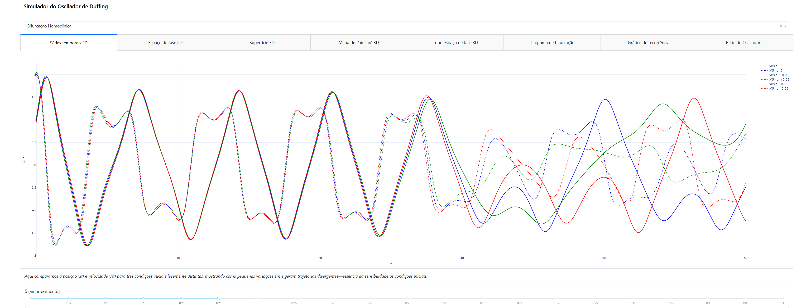
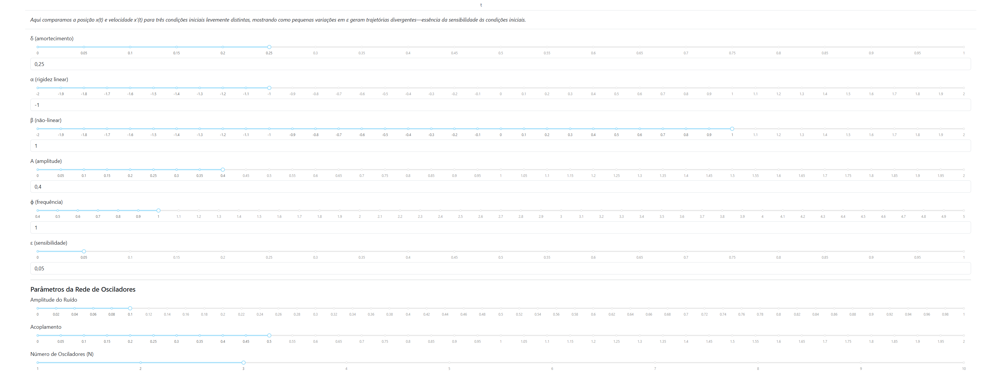
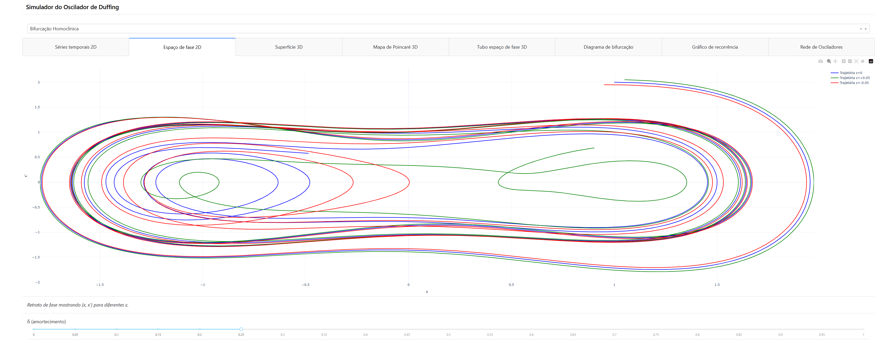
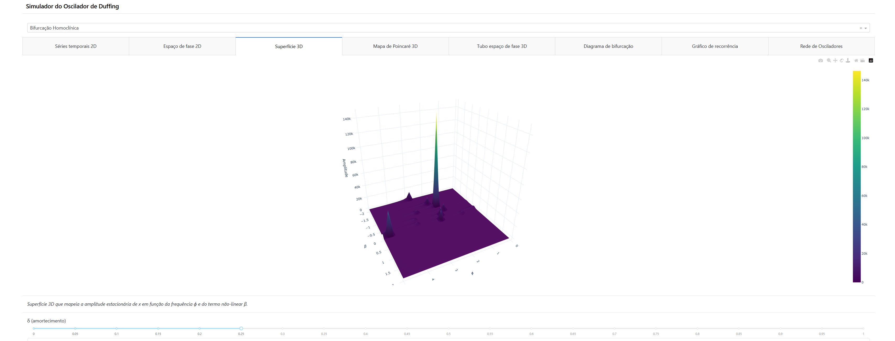
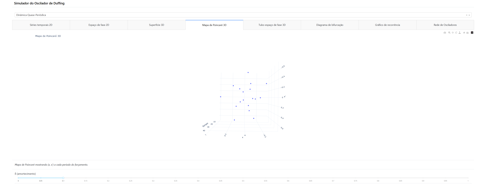
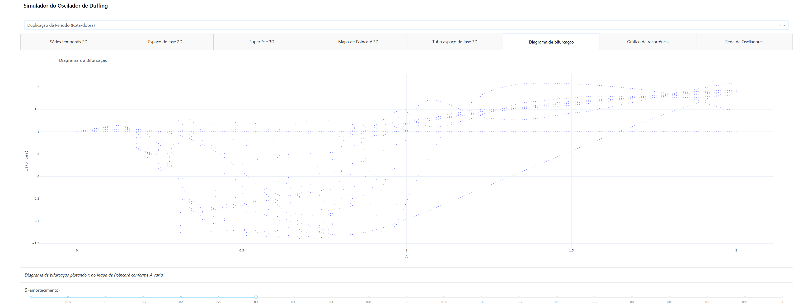
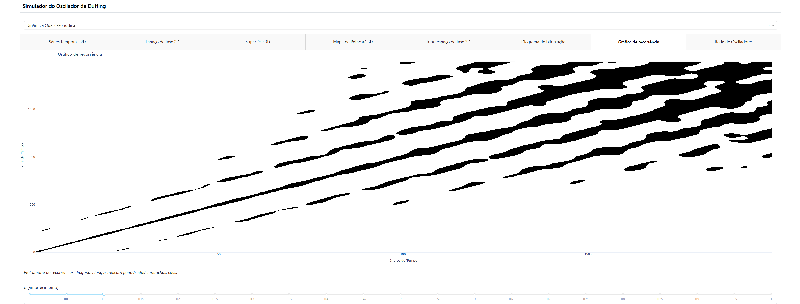
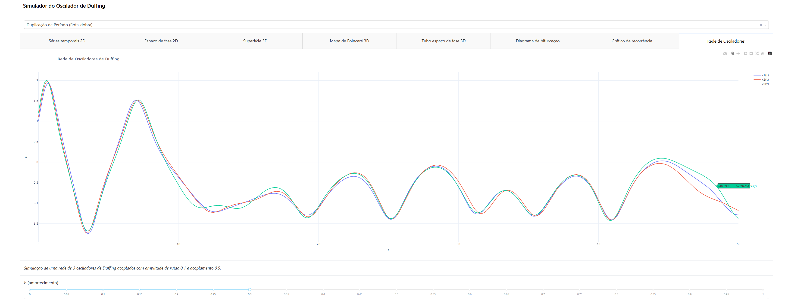

# README.md

Bem-vindo ao **Simulador do Oscilador de Duffing**! 👋

Este guia simples ajudará você a instalar e executar o simulador em **Linux**, **Windows** e **macOS**.

---

## Estrutura do Projeto

```
simulador-duffing/
├── app.py               # Código fonte principal (seu script Dash)
├── requirements.txt     # Lista de bibliotecas necessárias
├── scripts/             # Scripts de instalação e execução
│   ├── install_run.sh   # Linux/macOS
│   └── install_run.bat  # Windows
├── assets/              # Recursos estáticos (imagens de demonstração)
│   ├── diagrama-bifurcacao.png
│   ├── espaço-fase-2d.png
│   ├── espaço-fase-3d.png
│   ├── gráfico-de-recorrência.png
│   ├── parametros.png
│   ├── poincare.png
│   ├── rede-osciladores.png
│   ├── series-temporais.png
│   ├── superficie-3d.png
│   └── cc-ufg.png
└── README.md            # Este arquivo de instruções
```

---

## 1. Pré-requisitos

* **Python 3.7+** instalado no seu sistema. Você pode verificar com:

  ```bash
  python --version
  ```
* **Git** (opcional, para clonar o repositório).

---

## 2. Opções de Execução

### 2.1. Usando os Scripts Automatizados

#### 2.1.1. Linux e macOS

1. Abra o **Terminal**.
2. Navegue até a pasta de scripts:

   ```bash
   cd /caminho/para/simulador-duffing/scripts
   ```
3. Dê permissão e execute o script:

   ```bash
   chmod +x install_run.sh
   ./install_run.sh
   ```

Isso irá:

* Criar e ativar um ambiente virtual (`venv`).
* Instalar as dependências do `requirements.txt`.
* Iniciar o aplicativo Dash (`python app.py`).

Após iniciado, abra seu navegador em http://127.0.0.1:8050/ para acessar o simulador.

#### 2.1.2. Windows

1. Abra o **Prompt de Comando** (cmd).
2. Navegue até a pasta de scripts:

   ```batch
   cd C:\caminho\para\simulador-duffing\scripts
   ```
3. Execute o script:

   ```batch
   install_run.bat
   ```

Isso irá:

* Criar e ativar um ambiente virtual (`venv`).
* Instalar as dependências.
* Iniciar o aplicativo (`python app.py`).

Após iniciado, abra seu navegador em http://127.0.0.1:8050/ para acessar o simulador.

---

## 3. Exemplo de Uso e Demonstração

### 3.1 Séries Temporais


*Evolução temporal de posição e velocidade.*

### 3.2 Variação de Parâmetros


*Exemplo de variação de parâmetros e seus impactos no sistema.*

### 3.3 Espaço de Fase 2D


*Fluxo do sistema com setas direcionais.*

### 3.4 Superfície 3D


*Superfície 3D do potencial duffingiano.*

### 3.5 Seção de Poincaré


*Seção de Poincaré evidenciando a estrutura do atrator.*

### 3.6 Espaço de Fase 3D


*Visualização tridimensional do espaço de fase.*

### 3.7 Diagrama de Bifurcação


*Mostra pontos de transição para comportamento caótico em função da amplitude A.*

### 3.8 Gráfico de Recorrência


*Mapa de recorrência destacando padrões periódicos e caóticos.*

### 3.9 Rede de Osciladores


*Visualização da interação em rede de múltiplos osciladores.*

---

## 4. Suporte

Se tiver problemas:

* Verifique se seguiu o passo a passo.
* Confira se seu sistema atende aos pré-requisitos.
* Abra uma *issue* no repositório ou contate o mantenedor.

Boa simulação! 🚀
